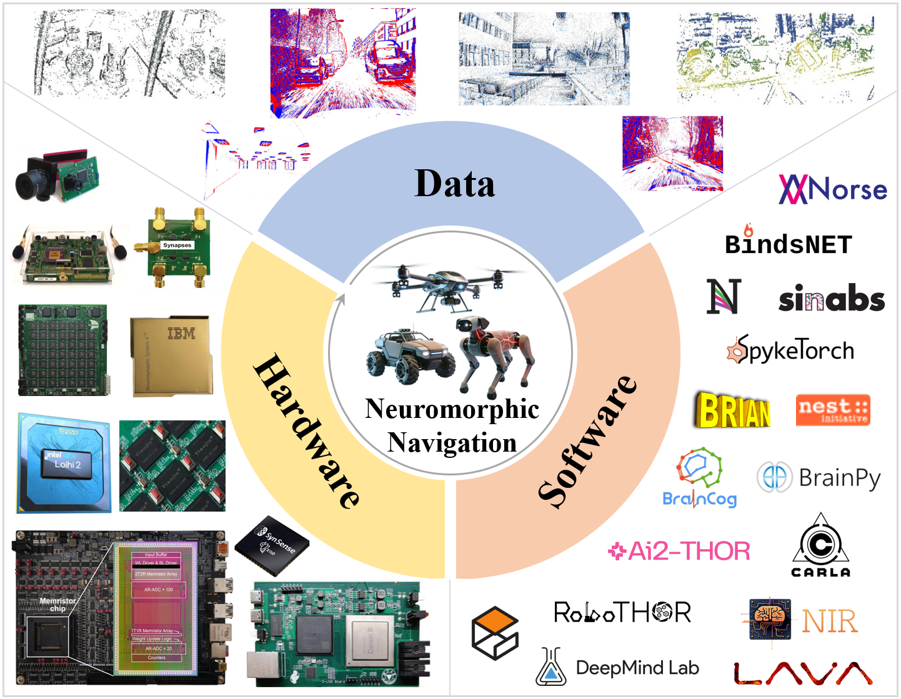

# Awesome-Neuromorphic-Navigation-Resources [](https://awesome.re)



This is a repository of **Neuromorphic Navigation** survey from **Southeast University, Nanjing, China**. 

It aims to provide a curated collection of resources for researchers and practitioners interested in neuromorphic navigation, including datasets, hardware platforms, and software tools.

If you find this repository helpful, please consider Stars ⭐ or Sharing 👋.

> [!NOTE]  
> If you find any missing resources, feel free to submit a **Pull Request** or open an **Issue**. We're thrilled to collaborate with you on this repository.


BibTeX Citation

```bibtex
@article{zhang2026survey,
  author = {Zhang, Youdong and He, Xu and Meng, Xiaolin and et al.},
  title = {A Survey on Neuromorphic Navigation: Implementation Resources, Challenges and Perspectives},
  journal = {TechRxiv},
  year = {2026},
  month = {feb},
  doi = {10.36227/techrxiv.177040597.75784815/v1},
  note = {Preprint}
}
```


- [Data Resources](#data-resources)
  - [Real-World Datasets](#real-world-datasets)
  - [Event Simulators and Simulated Datasets](#event-simulators-and-simulated-datasets)
    - [Event Simulators](#event-simulators)
    - [Representative Work Using Simulated Datasets](#representative-work-using-simulated-datasets)
- [Hardware Resources](#hardware-resources)
  - [Neuromorphic Sensors](#neuromorphic-sensors)
    - [Vision Sensors](#vision-sensors)
    - [Auditory Sensors](#auditory-sensors)
    - [Tactile Sensors](#tactile-sensors)
    - [Olfactory Sensors](#olfactory-sensors)
    - [Wireless Sensors](#wireless-sensors)
  - [Neuromorphic Processors](#neuromorphic-processors)
- [Software Resources](#software-resources)
  - [Algorithm Programming Tools](#algorithm-programming-tools)
  - [Brain Network Simulators](#brain-network-simulators)
  - [Neuromorphic Hardware Toolchains](#neuromorphic-hardware-toolchains)
  - [Scene Simulators](#scene-simulators)
  - [Others](#others)


## Data Resources

### Real-World Datasets
|      Dataset       |    Pub.    | Paper                                                                                                                                                                                  |                             Open Resource                              |
|:------------------:|:----------:|----------------------------------------------------------------------------------------------------------------------------------------------------------------------------------------|:----------------------------------------------------------------------:|
|     DAVIS240C      | IJRR-2017  | [The event-camera dataset and simulator: Event-based data for pose estimation, visual odometry, and SLAM](https://journals.sagepub.com/doi/10.1177/0278364917691115)                   |           [Website](https://rpg.ifi.uzh.ch/davis_data.html)            |
|       MVSEC        |  RAL-2018  | [The Multivehicle Stereo Event Camera Dataset: An Event Camera Dataset for 3D Perception](https://ieeexplore.ieee.org/document/8288670)                                                |          [Website](https://daniilidis-group.github.io/mvsec/)          |
|        DSEC        |  RAL-2021  | [DSEC: A Stereo Event Camera Dataset for Driving Scenarios](https://ieeexplore.ieee.org/document/9387069)                                                                              |               [GitHub](https://github.com/uzh-rpg/DSEC)                |
|       M2DGR        |  RAL-2022  | [M2DGR: A Multi-Sensor and Multi-Scenario SLAM Dataset for Ground Robots](https://ieeexplore.ieee.org/document/9664374)                                                                |             [GitHub](https://github.com/SJTU-ViSYS/M2DGR)              |
|      UZH-FPV       | ICRA-2019  | [Are We Ready for Autonomous Drone Racing? The UZH-FPV Drone Racing Dataset](https://ieeexplore.ieee.org/document/8793887)                                                             |                   [Website](https://fpv.ifi.uzh.ch/)                   |
|       D-eDVS       | ICRA-2014  | [Event-based 3D SLAM with a depth-augmented dynamic vision sensor](https://ieeexplore.ieee.org/document/6906882)                                                                       |                                   -                                    |
|       DDD17        | ICML-2017  | [DDD17: End-To-End DAVIS Driving Dataset](https://arxiv.org/abs/1711.01458)                                                                                                            |                [Website](sensors.ini.uzh.ch/databases)                 |
|       DDD20        | ITSC-2020  | [DDD20 End-to-End Event Camera Driving Dataset: Fusing Frames and Events with Deep Learning for Improved Steering Prediction](https://ieeexplore.ieee.org/document/9294515)            |          [Website](http://sensors.ini.uzh.ch/databases.html)           |
|       VECtor       |  RAL-2022  | [VECtor: A Versatile Event-Centric Benchmark for Multi-Sensor SLAM](https://ieeexplore.ieee.org/document/9809788)                                                                      |      [Website](https://star-datasets.github.io/vector/download/)       |
|      ViViD++       |  RAL-2022  | [ViViD++ : Vision for Visibility Dataset](https://ieeexplore.ieee.org/document/9760091)                                                                                                |            [Website](https://visibilitydataset.github.io/)             |
|      TUM-VIE       | IROS-2021  | [TUM-VIE: The TUM Stereo Visual-Inertial Event Dataset](https://ieeexplore.ieee.org/document/9636728)                                                                                  |      [Website](https://service.tib.eu/ldmservice/dataset/tum-vie)      |
| Brisbane-Event-VPR |  RAL-2020  | [Event-Based Visual Place Recognition With Ensembles of Temporal Windows](https://ieeexplore.ieee.org/document/9201344)                                                                |     [GitHub](https://github.com/Tobias-Fischer/ensemble-event-vpr)     |
|      GRIFFIN       |  RAL-2021  | [The GRIFFIN Perception Dataset: Bridging the Gap Between Flapping-Wing Flight and Robotic Perception](https://ieeexplore.ieee.org/document/9345513)                                   |             [Website](https://zenodo.org/records/11404043)             |
|      AGRI-EBV      | ICRA-2021  | [An Event-based Vision Dataset for Visual Navigation Tasks in Agricultural Environments](https://ieeexplore.ieee.org/document/9561741)                                                 |    [Website](https://ieee-dataport.org/open-access/agri-ebv-autumn)    |
|   FusionPortable   | IROS-2022  | [FusionPortable: A Multi-Sensor Campus-Scene Dataset for Evaluation of Localization and Mapping Accuracy on Diverse Platforms](https://ieeexplore.ieee.org/abstract/document/9982119)  |  [Website](https://fusionportable.github.io/dataset/fusionportable/)   |
|        M3ED        | CVPRW-2023 | [M3ED: Multi-Robot, Multi-Sensor, Multi-Environment Event Dataset](https://ieeexplore.ieee.org/document/10209006)                                                                      |           [GitHub](https://github.com/daniilidis-group/m3ed)           |
|  Hadviger et al.   | ECMR-2023  | [Stereo Visual Localization Dataset Featuring Event Cameras](https://ieeexplore.ieee.org/document/10256407)                                                                            |   [Website](http://www.bitbucket.com/unizg-fer-lamor/event-dataset)    |
|   PKU-DAVIS-SOD    | TPAMI-2023 | [SODFormer: Streaming Object Detection With Transformer Using Events and Frames](https://ieeexplore.ieee.org/document/10195232)                                                        |  [Website](https://www.pkuml.org/research/pku-davis-sod-dataset.html)  |
|        ECMD        |  TIV-2024  | [ECMD: An Event-Centric Multisensory Driving Dataset for SLAM](https://ieeexplore.ieee.org/abstract/document/10342726)                                                                 |              [GitHub](https://github.com/arclab-hku/ecmd)              |
|      MA-VIED       | TITS-2024  | [MA-VIED: A Multisensor Automotive Visual Inertial Event Dataset](https://ieeexplore.ieee.org/abstract/document/10254473)                                                              |  [GitHub](https://github.com/isarlab-department-engineering/MA-VIED)   |
|        CEAR        |  RAL-2024  | [CEAR: Comprehensive Event Camera Dataset for Rapid Perception of Agile Quadruped Robots](https://ieeexplore.ieee.org/document/10592643)                                               |               [GitHub](https://github.com/DARoSLab/cear)               |
|       NSAVP        | IJRR-2025  | [Dataset and Benchmark: Novel Sensors for Autonomous Vehicle Perception](https://doi.org/10.1177/02783649241273554)                                                                    |             [Website](https://umautobots.github.io/nsavp)              |
|        M2P2        | ArXiv-2025 | [M2P2: A Multi-Modal Passive Perception Dataset for Off-Road Mobility in Extreme Low-Light Conditions](https://arxiv.org/abs/2410.01105)                                               |           [Website](https://cs.gmu.edu/~xiao/Research/M2P2/)           |
|       M3DSS        | ICRA-2025  | [M3DSS: A Multi-Platform, Multi-Sensor, and Multi-Scenario Dataset for SLAM System](https://ieeexplore.ieee.org/document/11128631)                                                     |              [GitHub](https://github.com/NEUFS-MA/M3DSS)               |
|   NYC-Event-VPR    | ICRA-2025  | [NYC-Event-VPR: A Large-Scale High-Resolution Event-Based Visual Place Recognition Dataset in Dense Urban Environments](https://ieeexplore.ieee.org/document/11128789)                 |            [GitHub](https://github.com/ai4ce/NYC-Event-VPR)            |
|  FusionPortableV2  | IJRR-2025  | [FusionPortableV2: A unified multi-sensor dataset for generalized SLAM across diverse platforms and scalable environments](https://journals.sagepub.com/doi/10.1177/02783649241303525) | [Website](https://fusionportable.github.io/dataset/fusionportable_v2/) |

>- ITSC: International Conference on Intelligent Transportation Systems
>- ECMR: European Conference on Mobile Robots

### Event Simulators and Simulated Datasets
#### Event Simulators

|     Simulator     |              Pub.              | Paper                                                                                                                                                         |                      Open Resource                      |
|:-----------------:|:------------------------------:|---------------------------------------------------------------------------------------------------------------------------------------------------------------|:-------------------------------------------------------:|
|       ESIM        |           CoRL-2018            | [ESIM: an Open Event Camera Simulator](https://rpg.ifi.uzh.ch/docs/CORL18_Rebecq.pdf)                                                                         |      [GitHub](https://github.com/uzh-rpg/rpg_esim)      |
|        v2e        |           CVPRW-2021           | [v2e: From Video Frames to Realistic DVS Events](https://ieeexplore.ieee.org/document/9523069)                                                                |       [GitHub](https://github.com/SensorsINI/v2e)       |
| DVS Gazebo Plugin |          SIMPAR-2016           | [Towards a framework for end-to-end control of a simulated vehicle with spiking neural networks](https://ieeexplore.ieee.org/document/7862386)                |                            -                            |
|      PIX2NVS      |           ICIP-2017            | [PIX2NVS: Parameterized conversion of pixel-domain video frames to neuromorphic vision streams](https://ieeexplore.ieee.org/document/8296630)                 |      [GitHub](https://github.com/PIX2NVS/PIX2NVS)       |
|       pyDVS       |           SSCI-2016            | [pyDVS: An extensible, real-time Dynamic Vision Sensor emulator using off-the-shelf hardware](https://ieeexplore.ieee.org/document/7850249)                   |       [GitHub](https://github.com/chanokin/pyDVS)       |
|     EventGAN      |           ICCP-2021            | [EventGAN: Leveraging Large Scale Image Datasets for Event Cameras](https://ieeexplore.ieee.org/abstract/document/9466265)                                    |     [GitHub](https://github.com/alexzzhu/EventGAN)      |
|       ViSim       |           ArXiv-2018           | [InteriorNet: Mega-scale Multi-sensor Photo-realistic Indoor Scenes Dataset](https://arxiv.org/abs/1809.00716)                                                |           [Website](https://interiornet.org/)           |
|       VID2E       |           CVPR-2020            | [Video to Events: Recycling Video Datasets for Event Cameras](https://ieeexplore.ieee.org/document/9156296)                                                   |     [GitHub](https://github.com/uzh-rpg/rpg_vid2e)      |
|       ICNS        | Frontiers in Neuroscience-2021 | [Event Camera Simulator Improvements via Characterized Parameters](https://www.frontiersin.org/journals/neuroscience/articles/10.3389/fnins.2021.702765/full) | [GitHub](https://github.com/neuromorphicsystems/IEBCS)  |
|       VISTA       |           ICRA-2022            | [VISTA 2.0: An Open, Data-driven Simulator for Multimodal Sensing and Policy Learning for Autonomous Vehicles](https://ieeexplore.ieee.org/document/9812276)  |   [GitHub](https://github.com/vista-simulator/vista)    |
|   DVS-Voltmeter   |           ECCV-2022            | [DVS-Voltmeter: Stochastic Process-Based Event Simulator for Dynamic Vision Sensors](https://link.springer.com/chapter/10.1007/978-3-031-20071-7_34)          |   [GitHub](https://github.com/Lynn0306/DVS-Voltmeter)   |
|       V2CE        |           ICRA-2024            | [V2CE: Video to Continuous Events Simulator](https://ieeexplore.ieee.org/document/10609864)                                                                   | [GitHub](https://github.com/ucsd-hdsi-dvs/V2CE-Toolbox) |
|      EREBUS       |           ArXiv-2025           | [EREBUS: End-to-end Robust Event Based Underwater Simulation](https://arxiv.org/abs/2511.01381)                                                               |        [GitHub](https://github.com/apalkk/EBUS)         |

>- CoRL: Conference on Robot Learning
>- SIMPAR:  IEEE International Conference on Simulation, Modeling, and Programming for Autonomous Robots
>- ICIP: IEEE International Conference on Image Processing
>- SSCI: IEEE Symposium Series on Computational Intelligence
>- ICCP: IEEE International Conference on Computational Photography

#### Representative Work Using Simulated Datasets
- [TIP-2022] [Asynchronous Spatio-Temporal Memory Network for Continuous Event-Based Object Detection](https://ieeexplore.ieee.org/document/9749022)
- [ICCV-2023] [Learning Optical Flow from Event Camera with Rendered Dataset](https://openaccess.thecvf.com/content/ICCV2023/papers/Luo_Learning_Optical_Flow_from_Event_Camera_with_Rendered_Dataset_ICCV_2023_paper.pdf)
- [TRO-2024] [CMax-SLAM: Event-Based Rotational-Motion Bundle Adjustment and SLAM System Using Contrast Maximization](https://ieeexplore.ieee.org/abstract/document/10474186)
- [CVPR-2024] [Towards Robust Event-guided Low-Light Image Enhancement: A Large-Scale Real-World Event-Image Dataset and Novel Approach](https://openaccess.thecvf.com/content/CVPR2024/papers/Liang_Towards_Robust_Event-guided_Low-Light_Image_Enhancement_A_Large-Scale_Real-World_Event-Image_CVPR_2024_paper.pdf)
- [CVPR-2025] [Ev-3DOD: Pushing the Temporal Boundaries of 3D Object Detection with Event Cameras](https://openaccess.thecvf.com/content/CVPR2025/papers/Cho_Ev-3DOD_Pushing_the_Temporal_Boundaries_of_3D_Object_Detection_with_CVPR_2025_paper.pdf)


## Hardware Resources
### Neuromorphic Sensors
#### Vision Sensors
|  Sensor  |                       Pub.                        | Paper                                                                                                                                                                               |                                    Link                                    |
|:--------:|:-------------------------------------------------:|-------------------------------------------------------------------------------------------------------------------------------------------------------------------------------------|:--------------------------------------------------------------------------:|
|   DVS    |     IEEE Journal of Solid-State Circuits-2008     | [A 128 × 128 120 dB 15 μs Latency Asynchronous Temporal Contrast Vision Sensor](https://ieeexplore.ieee.org/document/4444573)                                                       |                                     -                                      |
|   ATIS   |                    ISSCC-2010                     | [A QVGA 143dB dynamic range asynchronous address-event PWM dynamic image sensor with lossless pixel-level video compression](https://ieeexplore.ieee.org/abstract/document/5433973) |                                     -                                      |
| DAVIS240 |     IEEE Journal of Solid-State Circuits-2014     | [A 240 × 180 130 dB 3 µs Latency Global Shutter Spatiotemporal Vision Sensor](https://ieeexplore.ieee.org/document/6889103)                                                         |  [Link](https://docs.inivation.com/_static/hardware_guides/davis240.pdf)   |
| DAVIS346 | IEEE Trans. Circuits Syst. II-Express Briefs-2018 | [Front and Back Illuminated Dynamic and Active Pixel Vision Sensors Comparison](https://ieeexplore.ieee.org/document/8334288)                                                       | [Link](https://docs.inivation.com/hardware/current-products/davis346.html) |
| CeleX-V  |                    CVPRW-2019                     | [Live Demonstration: CeleX-V: A 1M Pixel Multi-Mode Event-Based Sensor](https://ieeexplore.ieee.org/document/9025556)                                                               |                    [Link](https://github.com/CelePixel)                    |
|  Vidar   |                 Engineering-2023                  | [1000× Faster Camera and Machine Vision with Ordinary Devices](https://www.sciencedirect.com/science/article/pii/S2095809922002077)                                                 |                                     -                                      |
|  Speck   |                 Nat. Commun.-2024                 | [Spike-based dynamic computing with asynchronous sensing-computing neuromorphic chip](https://www.nature.com/articles/s41467-024-47811-6)                                           |         [Link](https://www.synsense.ai/zh-hans/products/speck-2/)          |
| Tianmouc |                    Nature-2024                    | [A vision chip with complementary pathways for open-world sensing](https://www.nature.com/articles/s41586-024-07358-4)                                                              |                                     -                                      |


| Company | Cameras / Devices                                                                                                                                                                                                                                                                                                                                                                                                                                                                                                                                                                                                                                                                                                                                                  | Softwares/Tools                                                                                                      |
|---------|--------------------------------------------------------------------------------------------------------------------------------------------------------------------------------------------------------------------------------------------------------------------------------------------------------------------------------------------------------------------------------------------------------------------------------------------------------------------------------------------------------------------------------------------------------------------------------------------------------------------------------------------------------------------------------------------------------------------------------------------------------------------|----------------------------------------------------------------------------------------------------------------------|
| [iniVation](https://inivation.com/) & [SynSense](https://www.synsense.ai/)| [DAVIS346](https://docs.inivation.com/hardware/current-products/davis346.html), [DAVIS346 AER](https://docs.inivation.com/hardware/current-products/davis346-aer.html), [DVXplorer](https://docs.inivation.com/hardware/current-products/dvxplorer.html), [DVXplorer Lite](https://docs.inivation.com/hardware/current-products/dvxplorer-lite.html), [DVXplorer Micro](https://docs.inivation.com/hardware/current-products/dvxplorer-micro.html), [DVXplorer S Duo](https://docs.inivation.com/hardware/current-products/dvxplorer-s-duo.html), [Stereo Kit](https://docs.inivation.com/hardware/current-products/stereo-kit.html)                                                                                                                               | [Software Solutions](https://docs.inivation.com/software/introduction.html)                                          |
| [Prophesee](https://www.prophesee.ai/) | [Metavision® sensor GENX320](https://www.prophesee.ai/event-based-sensor-genx320/), [Metavision® sensor IMX636](https://www.prophesee.ai/event-based-sensor-imx636-sony-prophesee/), [Metavision® sensor IMX646](https://www.prophesee.ai/event-based-sensor-imx646-sony-prophesee/), [Metavision® sensor IMX637](https://www.prophesee.ai/event-based-sensor-imx637-sony-prophesee/), [Metavision® sensor IMX647](https://www.prophesee.ai/event-based-sensor-imx647-sony-prophesee/), </br> [GenX320 – CM2](https://www.prophesee.ai/optical-flex-module-genx320-info/), [GenX320 – 4×5](https://www.prophesee.ai/ca4x5-genx320-info/), [GenX320 – CN1](https://www.prophesee.ai/cn1-genx320-info/), [GenX320 – CN3](https://www.prophesee.ai/cn3-genx320-info/) | [Metavision SDK](https://docs.prophesee.ai/stable/index.html) <br> <br> [OpenEB](https://github.com/prophesee-ai/openeb) |
| [Lucid Vision Labs](https://thinklucid.com/triton2-evs/) | [Triton2 EVS 0.9 MP Model (IMX636)](https://thinklucid.com/product/triton2-evs-0-9mp-imx636/), [Triton2 EVS 0.3 MP Model (IMX637)](https://thinklucid.com/product/triton2-evs-0-3mp-imx637/)                                                                                                                                                                                                                                                                                                                                                                                                                                                                                                                                                                       | —                                                                                                                    |
| [IDS Imaging](https://en.ids-imaging.com/ueye-evs-cameras.html) | [µEye XCP-E UE-39B0XCP-E (IMX636)](https://en.ids-imaging.com/store/ue-39b0xcp-e.html)                                                                                                                                                                                                                                                                                                                                                                                                                                                                                                                                                                                                                                                                             | [Metavision SDK](https://docs.prophesee.ai/stable/index.html) (≥ 4.6.2)                                              |

#### Auditory Sensors
- AER EAR: A Matched Silicon Cochlea Pair With Address Event Representation Interface [[Paper](https://ieeexplore.ieee.org/document/4061005)]
- Asynchronous binaural spatial audition sensor with 2 × 64 × 4 channel output [[Paper](https://ieeexplore.ieee.org/document/6658899)] [[Link](https://inilabs.com/products/dynamic-audio-sensor/)]
- A 0.5V 55μW 64×2-channel binaural silicon cochlea for event-driven stereo-audio sensing [[Paper](https://ieeexplore.ieee.org/document/7418070)]
- Neuromorphic acoustic sensing using an adaptive microelectromechanical cochlea with integrated feedback [[Paper](https://www.nature.com/articles/s41928-023-00957-5)]

#### Tactile Sensors
- NeuroTac: A Neuromorphic Optical Tactile Sensor applied to Texture Recognition [[Paper](https://ieeexplore.ieee.org/document/9197046/)]
- A spiking and adapting tactile sensor for neuromorphic applications [[Paper](https://www.nature.com/articles/s41598-020-74219-1)]
- An artificial piezotronic synapse for tactile perception [[Paper](https://www.sciencedirect.com/science/article/pii/S221128552030313X)]
- Neuromorphic capacitive tactile sensors inspired by slowly adaptive mechanoreceptors [[Paper](https://ieeexplore.ieee.org/document/9841988)]
- Neuromorphic antennal sensory system [[Paper](https://www.nature.com/articles/s41467-024-46393-7)]

#### Olfactory Sensors
- Analog VLSI Circuit Implementation of an Adaptive Neuromorphic Olfaction Chip [[Paper](https://ieeexplore.ieee.org/document/4061019)]
- Artificial Olfactory Neuron for an In-Sensor Neuromorphic Nose [[Paper](https://advanced.onlinelibrary.wiley.com/doi/10.1002/advs.202106017)]
- A Neuromorphic Electronic Nose Design [[Paper](https://ieeexplore.ieee.org/document/10994250)]
- A bio-inspired neuromorphic olfaction system for highly sensitive and selective gas sensing at room temperature [[Paper](https://www.sciencedirect.com/science/article/pii/S0925400525009748)]
- Gas localization and tracking using neuromorphic olfactory circuit with coupled sensors and memristive neurons [[Paper](https://www.cell.com/device/fulltext/S2666-9986(25)00205-4)]
- Neuromorphic olfaction with ultralow-power gas sensors and ovonic threshold switch [[Paper](https://www.science.org/doi/full/10.1126/sciadv.adv9222)]

#### Wireless Sensors
- NeuroRadar: A Neuromorphic Radar Sensor for Low-Power IoT Systems [[Paper](https://dl.acm.org/doi/10.1145/3625687.3625788)]
- RF neuromorphic spiking sensor for smart IoT devices [[Paper](https://link.springer.com/article/10.1007/s10470-023-02164-w)]
- Neuromorphic Wireless Cognition: Event-Driven Semantic Communications for Remote Inference [[Paper](https://ieeexplore.ieee.org/document/10016643)]
- Neuromorphic Integrated Sensing and Communications [[Paper](https://ieeexplore.ieee.org/document/9997098)]


### Neuromorphic Processors
|                                                  Chips                                                  | Signals | On-chip learning | Process (nm) | Neurons / Synapses | Power (mW) | Energy/SOP (pJ) |                                            Software                                            |
|:-------------------------------------------------------------------------------------------------------:|:-------:|:----------------:|:------------:|:------------------:|:----------:|:---------------:|:----------------------------------------------------------------------------------------------:|
|                        [Neurogrid](https://ieeexplore.ieee.org/document/6805187)                        |  Mixed  |        No        |     180      |    64 K / 100 M    |    2700    |       119       |          [NEF](https://web.stanford.edu/group/brainsinsilicon/blog/computation_nef/)           |
|                        [Braindrop](https://ieeexplore.ieee.org/document/8591981)                        |  Mixed  |       Yes        |      28      |     4 K / 16 M     |   N. A.    |      0.38       |          [NEF](https://web.stanford.edu/group/brainsinsilicon/blog/computation_nef/)           |
| [BrainScaleS](https://www.frontiersin.org/journals/neuroscience/articles/10.3389/fnins.2011.00117/full) |  Mixed  |       Yes        |     180      |    512 / 128 K     |   N. A.    |       100       |     [BrainScaleS OS](https://www.sciencedirect.com/science/article/pii/S0925231222006646)      |
|                      [BrainScaleS2](https://ieeexplore.ieee.org/document/9896927)                       |  Mixed  |       Yes        |      65      |    512 / 131 K     |   ~1000    |      N. A.      |     [BrainScaleS OS](https://www.sciencedirect.com/science/article/pii/S0925231222006646)      |
|    [ROLLS](https://www.frontiersin.org/journals/neuroscience/articles/10.3389/fnins.2015.00141/full)    |  Mixed  |       Yes        |     180      |     256 / 64 K     |     ~5     |      N. A.      |                            [PyNCS](https://github.com/inincs/pyNCS)                            |
|  [Dynap-SE](https://www.frontiersin.org/journals/neuroscience/articles/10.3389/fnins.2018.00891/full)   |  Mixed  |        No        |     180      |    1024 / 65 K     |     ~5     |       260       |              [Samna](https://synsense-sys-int.gitlab.io/samna/0.48.2/index.html)               |
|                [Dynap-SE2](https://iopscience.iop.org/article/10.1088/2634-4386/ad1cd7)                 |  Mixed  |       Yes        |     180      |    1024 / 65 K     |   N. A.    |       150       |              [Samna](https://synsense-sys-int.gitlab.io/samna/0.48.2/index.html)               |
|                          [Loihi](https://ieeexplore.ieee.org/document/8259423)                          | Digital |       Yes        |      14      |   128 K / 128 M    |   ~1000    |      23.6       |                            [Lava](https://github.com/lava-nc/lava)                             |
|                         [Loihi2](https://ieeexplore.ieee.org/document/9605018/)                         | Digital |       Yes        |      7       |    1 M / 120 M     |    <50     |      N. A.      |                            [Lava](https://github.com/lava-nc/lava)                             |
|                       [TrueNorth](https://ieeexplore.ieee.org/document/7229264/)                        | Digital |        No        |      28      |    1 M / 256 M     |    ~70     |       26        |                    [Corelet](https://ieeexplore.ieee.org/document/6707078)                     |
|                    [NorthPole](https://www.science.org/doi/10.1126/science.adh1174)                     | Digital |        No        |      12      |       N. A.        |   N. A.    |      N. A.      |                                             Custom                                             |
|                        [SpiNNaker](https://ieeexplore.ieee.org/document/6515159)                        | Digital |       Yes        |     130      |    18 K / 18 M     |   ~1000    |      4000       | [PyNN](https://github.com/NeuralEnsemble/PyNN), [NEST](https://github.com/nest/nest-simulator) |
|                             [SpiNNaker2](https://arxiv.org/abs/1911.02385)                              | Digital |       Yes        |      22      |   Configuration    |   ~1000    |       10        | [PyNN](https://github.com/NeuralEnsemble/PyNN), [NEST](https://github.com/nest/nest-simulator) |
|                      [Tianjic](https://www.nature.com/articles/s41586-019-1424-8)                       | Digital |        No        |      28      |    40 K / 10 M     |   ~1000    |      1.54       |                       [LynOS](https://lynxi.com/LynOS/22.html#nrxinxi11)                       |
|                   [TianjicX](https://www.science.org/doi/10.1126/scirobotics.abk2948)                   | Digital |       Yes        |      28      |    160 K / 20 M    |    ~600    |      N. A.      |                       [LynOS](https://lynxi.com/LynOS/22.html#nrxinxi11)                       |
|                  [Darwin](https://link.springer.com/article/10.1007/s11432-015-5511-7)                  | Digital |        No        |     180      |   2048 / 4.19 M    |    0.84    |      N. A.      |                    [DarwinOS](https://ieeexplore.ieee.org/document/9771131)                    |
|                                                 Darwin2                                                 | Digital |        No        |      55      |    147 k / 10 M    |    ~100    |      N. A.      |                    [DarwinOS](https://ieeexplore.ieee.org/document/9771131)                    |
|                  [Darwin3](https://academic.oup.com/nsr/article/11/5/nwae102/7631347)                   | Digital |       Yes        |      22      |     2.3 M / —      |   N. A.    |      5.47       |                    [DarwinOS](https://ieeexplore.ieee.org/document/9771131)                    |


## Software Resources
### Algorithm Programming Tools
|   Software   | Year | Programming Language | Paper                                                                                                                                                                               |                             Open Resource                             |
|:------------:|:----:|:--------------------:|-------------------------------------------------------------------------------------------------------------------------------------------------------------------------------------|:---------------------------------------------------------------------:|
|    SNN-TB    | 2017 |        Python        | [Conversion of Continuous-Valued Deep Networks to Efficient Event-Driven Networks for Image Classification](https://doi.org/10.3389%2Ffnins.2017.00682)                             | [GitHub](https://github.com/NeuromorphicProcessorProject/snn_toolbox) |
|   BindsNET   | 2018 |        Python        | [BindsNET: A Machine Learning-Oriented Spiking Neural Networks Library in Python](https://www.frontiersin.org/articles/10.3389/fninf.2018.00089)                                    |            [GitHub](https://github.com/BindsNET/bindsnet)             |
|  SpykeTorch  | 2019 |        Python        | [SpykeTorch: Efficient Simulation of Convolutional Spiking Neural Networks With at Most One Spike per Neuron](https://doi.org/10.3389%2Ffnins.2019.00625)                           |         [GitHub](https://github.com/miladmozafari/SpykeTorch)         |
|    Sinabs    | 2019 |        Python        | -                                                                                                                                                                                   |             [GitHub](https://github.com/synsense/sinabs)              |
|    cuSNN     | 2020 |         C++          | [Unsupervised Learning of a Hierarchical Spiking Neural Network for Optical Flow Estimation: From Events to Global Motion Perception](https://ieeexplore.ieee.org/document/8660483) |              [GitHub](https://github.com/tudelft/cuSNN)               |
|    Norse     | 2021 |        Python        | -                                                                                                                                                                                   |               [GitHub](https://github.com/norse/norse)                |
|    EvtSNN    | 2022 |         C++          | [EvtSNN: Event-driven SNN simulator optimized by population and pre-filtering](https://www.frontiersin.org/journals/neuroscience/articles/10.3389/fnins.2022.944262/full)           |                                   -                                   |
|   SNNtorch   | 2023 |        Python        | [Training Spiking Neural Networks Using Lessons From Deep Learning](https://ieeexplore.ieee.org/document/10242251)                                                                  |           [GitHub](https://github.com/jeshraghian/snntorch)           |
| SpikingJelly | 2023 |        Python        | [SpikingJelly: An open-source machine learning infrastructure platform for spike-based intelligence](https://www.science.org/doi/10.1126/sciadv.adi1480)                            |        [GitHub](https://github.com/fangwei123456/spikingjelly)        |
|    SPAIC     | 2024 |        Python        | [SPAIC: A Spike-Based Artificial Intelligence Computing Framework](https://ieeexplore.ieee.org/document/10384520)                                                                   |            [GitHub](https://github.com/zju-bmi-lab/SPAIC)             |


### Brain Network Simulators
| Software | Year |    Programming Language     | Paper                                                                                                                                                                             |                   Open Resource                    |
|:--------:|:----:|:---------------------------:|-----------------------------------------------------------------------------------------------------------------------------------------------------------------------------------|:--------------------------------------------------:|
| GENESIS  | 1988 |     Customized Language     | [GENESIS: A System for Simulating Neural Networks](https://proceedings.neurips.cc/paper/1988/hash/4c5bde74a8f110656874902f07378009-Abstract.html)                                 |         [Website](http://genesis-sim.org/)         |
|  Brian   | 2008 |           Python            | [Brian: a simulator for spiking neural networks in Python](https://www.frontiersin.org/journals/neuroinformatics/articles/10.3389/neuro.11.005.2008/full)                         |   [GitHub](https://github.com/brian-team/brian)    |
|   PyNN   | 2008 |           Python            | [PyNN: a common interface for neuronal network simulators](https://www.frontiersin.org/journals/neuroinformatics/articles/10.3389/neuro.11.011.2008/full)                         |  [GitHub](https://github.com/NeuralEnsemble/PyNN)  |
|  Brian2  | 2014 |           Python            | [Equation-oriented specification of neural models for simulations](https://www.frontiersin.org/journals/neuroinformatics/articles/10.3389/fninf.2014.00006/full)                  |   [GitHub](https://github.com/brian-team/brian2)   |
|  Nengo   | 2014 |           Python            | [Nengo: a Python tool for building large-scale functional brain models](https://doi.org/10.3389%2Ffninf.2013.00048)                                                               |      [GitHub](https://github.com/nengo/nengo)      |
| CARLsim  | 2015 |             C++             | [CARLsim 6: An Open Source Library for Large-Scale, Biologically Detailed Spiking Neural Network Simulation](https://ieeexplore.ieee.org/document/9892644)                        |   [GitHub](https://github.com/UCI-CARL/CARLsim6)   |
|   NEST   | 2019 |           Python            | [NEST: The Neural Simulation Tool](https://link.springer.com/rwe/10.1007/978-1-4614-7320-6_258-6)                                                                                 |  [GitHub](https://github.com/nest/nest-simulator)  |
|  NEURON  | 2022 | Customized Language, Python | [NEURON Simulation Environment](https://link.springer.com/rwe/10.1007/978-1-0716-1006-0_795)                                                                                      |  [Website](https://nrn.readthedocs.io/en/9.0.1/)   |
| BrainCog | 2023 |           Python            | [BrainCog: A spiking neural network based, brain-inspired cognitive intelligence engine for brain-inspired AI and brain simulation](https://doi.org/10.1016/j.patter.2023.100789) | [GitHub](https://github.com/BrainCog-X/Brain-Cog)  |
| BrainPy  | 2023 |           Python            | [BrainPy, a flexible, integrative, efficient, and extensible framework for general-purpose brain dynamics programming](https://elifesciences.org/articles/86365)                  | [GitHub](https://elifesciences.org/articles/86365) |


### Neuromorphic Hardware Toolchains
|    Software    | Year | Programming Language | Paper                                                                                                                                                                                          |                             Open Resource                             |
|:--------------:|:----:|:--------------------:|------------------------------------------------------------------------------------------------------------------------------------------------------------------------------------------------|:---------------------------------------------------------------------:|
|     DV-SDK     | 2020 |     C++, Python      | -                                                                                                                                                                                              |           [Website](https://docs.inivation.com/index.html)            |
| Metavision SDK | 2020 |     C++, Python      | -                                                                                                                                                                                              |        [Website](https://docs.prophesee.ai/stable/index.html)         |
|     NAVIS      | 2017 |          C#          | [NAVIS: Neuromorphic Auditory VISualizer Tool](https://www.sciencedirect.com/science/article/pii/S0925231216315624)                                                                            |          [GitHub](https://github.com/jpdominguez/NAVIS-Tool)          |
|    pyNAVIS     | 2021 |        Python        | [pyNAVIS: An open-source cross-platform software for spike-based neuromorphic audio information processing](https://www.sciencedirect.com/science/article/pii/S0925231221005130)               |           [GitHub](https://github.com/jpdominguez/pyNAVIS)            |
|    OpenNAS     | 2021 |      C++, VHDL       | [OpenNAS: Open Source Neuromorphic Auditory Sensor HDL code generator for FPGA implementations](https://www.sciencedirect.com/science/article/pii/S0925231220319627)                           |        [GitHub](https://github.com/RTC-research-group/OpenNAS)        |
|    DarwinOS    | 2022 |      DarwinMDL       | [Darwin-S: A Reference Software Architecture for Brain-Inspired Computers](https://ieeexplore.ieee.org/document/9771131)                                                                       |                                   -                                   |
| BrainScaleS OS | 2022 |     C++, Python      | [The operating system of the neuromorphic BrainScaleS-1 system](https://www.sciencedirect.com/science/article/pii/S0925231222006646)                                                           |                                   -                                   |
|     LynOS      | 2021 |     C++, Python      | -                                                                                                                                                                                              |         [Website](https://lynxi.com/LynOS/22.html#nrxinxi11)          |
|      Lava      | 2021 |        Python        | -                                                                                                                                                                                              |               [GitHub](https://github.com/lava-nc/lava)               |
|   sPyNNaker    | 2018 |      Python, C       | [sPyNNaker: A Software Package for Running PyNN Simulations on SpiNNaker](https://www.frontiersin.org/journals/neuroscience/articles/10.3389/fnins.2018.00816/full)                            |      [GitHub](https://github.com/SpiNNakerManchester/SpyNNaker)       |
|    Corelet     | 2013 |        Matlab        | [Cognitive computing programming paradigm: A Corelet Language for composing networks of neurosynaptic cores](https://ieeexplore.ieee.org/document/6707078)                                     |                                   -                                   |
|     Samma      | 2020 |        Python        | -                                                                                                                                                                                              | [Website](https://synsense-sys-int.gitlab.io/samna/0.48.2/index.html) |
|     PyNCS      | 2014 |        Python        | [PyNCS: a microkernel for high-level definition and configuration of neuromorphic electronic systems](https://www.frontiersin.org/journals/neuroinformatics/articles/10.3389/fninf.2014.00073) |               [GitHub](https://github.com/inincs/pyNCS)               |
|      NIR       | 2024 |        Python        | [Neuromorphic intermediate representation: A unified instruction set for interoperable brain-inspired computing](https://www.nature.com/articles/s41467-024-52259-9)                           |             [GitHub](https://github.com/neuromorphs/nir)              |

### Scene Simulators
|   Software   | Year | Programming Language | Paper                                                                                                                      |                         Open Resource                          |
|:------------:|:----:|:--------------------:|----------------------------------------------------------------------------------------------------------------------------|:--------------------------------------------------------------:|
|    Gazebo    | 2004 |     C++, Python      | [Design and use paradigms for Gazebo, an open-source multi-robot simulator](https://ieeexplore.ieee.org/document/1389727)  |             [GitHub](https://github.com/gazebosim)             |
| DeepMind Lab | 2016 |        Python        | [DeepMind Lab](https://arxiv.org/abs/1612.03801)                                                                           |        [GitHub](https://github.com/google-deepmind/lab)        |
|   AI2-THOR   | 2017 |      C#, Python      | [AI2-THOR: An Interactive 3D Environment for Visual AI](https://arxiv.org/abs/1712.05474)                                  |          [GitHub](https://github.com/allenai/ai2thor)          |
|    CARLA     | 2017 |     C++, Python      | [CARLA: An Open Urban Driving Simulator](https://proceedings.mlr.press/v78/dosovitskiy17a.html)                            |       [GitHub](https://github.com/carla-simulator/carla)       |
|    MINOS     | 2017 |        Python        | [MINOS: Multimodal Indoor Simulator for Navigation in Complex Environments](https://arxiv.org/abs/1712.03931)              |                               -                                |
|   House3D    | 2018 |     C++, Python      | [Building Generalizable Agents with a Realistic and Rich 3D Environment](https://arxiv.org/abs/1801.02209)                 |     [GitHub](https://github.com/facebookresearch/House3D)      |
|   Habitat    | 2019 |        Python        | [Habitat: A Platform for Embodied AI Research](https://ieeexplore.ieee.org/document/9010745/)                              |   [GitHub](https://github.com/facebookresearch/habitat-lab)    |
|   RoboTHOR   | 2020 |        Python        | [RoboTHOR: An Open Simulation-to-Real Embodied AI Platform](https://ieeexplore.ieee.org/document/9157346/)                 |    [GitHub](https://github.com/allenai/robothor-challenge)     |
|    LGSVL     | 2020 |          C#          | [LGSVL Simulator: A High Fidelity Simulator for Autonomous Driving](https://ieeexplore.ieee.org/abstract/document/9294422) |         [GitHub](https://github.com/lgsvl/simulator/)          |
|    AirSim    | 2020 |        Python        | [AirSim Drone Racing Lab](https://proceedings.mlr.press/v123/madaan20a.html)                                               | [GitHub](https://github.com/microsoft/AirSim-Drone-Racing-Lab) |


### Others
|  Software   | Year | Programming Language | Paper                                                                                                                                                    |                             Open Resource                             |
|:-----------:|:----:|:--------------------:|----------------------------------------------------------------------------------------------------------------------------------------------------------|:---------------------------------------------------------------------:|
|     NRP     | 2017 |        Python        | [Connecting Artificial Brains to Robots in a Comprehensive Simulation Framework: The Neurorobotics Platform](https://doi.org/10.3389%2Ffnbot.2017.00002) |            [Website](https://neurorobotics.net/index.html)            |
|    Tonic    | 2021 |        Python        | -                                                                                                                                                        |            [GitHub](https://github.com/neuromorphs/tonic)             |
| OpenRatSLAM | 2013 | MATLAB, C++, Python  | [OpenRatSLAM: an open source brain-based SLAM system](https://doi.org/10.1007/s10514-012-9317-9)                                                         | [Website](https://researchdata.edu.au/openratslam-source-code/448389) |
| SpikeCoding | 2022 |    MATLAB, Python    | [A toolbox for neuromorphic perception in robotics](https://ieeexplore.ieee.org/document/9845664)                                                        |           [GitHub](https://github.com/JuSquare/SpikeCoding)           |
|  CARLsim++  | 2025 |     C++, Python      | [An integrated toolbox for creating neuromorphic edge applications](https://doi.org/10.1088/2634-4386/adad0f)                                            |            [GitHub](https://github.com/UCI-CARL/CARLsimPP)            |


## Open Research and Development Communities
- Open Neuromorphic: https://open-neuromorphic.org/
> Open Neuromorphic is a global community dedicated to advancing education, research, and open-source collaboration in brain-inspired AI and neuromorphic computing.

- Intel Neuromorphic Research Community : https://www.intel.com/content/www/us/en/research/neuromorphic-community.html
> The Intel Neuromorphic Research Community (Intel NRC) is an ecosystem of academic groups, government labs, research institutions, and companies around the world working with Intel to further neuromorphic computing and develop innovative AI applications.

- NeuroPAC: https://www.neuropac.info/
> NeuroPAC was launched in 2021 as an NSF-supported effort under the AccelNet (Accelerating Research through International Network-to-Network Collaborations) program led by the University of Maryland and Johns Hopkins University. Its goal is to network neuromorphic engineers with computational neuroscientists, roboticists, and computational theory and perception researchers to advance the foundations of  Neuromorphic Intelligence.

- Neuromorphs: https://neuromorphs.net/
> Welcome to the brand new NEUROMORPHS home for all students, researchers, faculty, developers, entrepreneurs and all interested in the field of neuromorphic engineering and computing!
<br> Here are the services available for our community:
<br>- https://forum.neuromorphs.net (Flarum): this is a forum service for the community at large to share general news and results, make announcements and start discussions on topics related to neuromorphic engineering and computing. Here we can share information in smaller sub-groups and teams, but it is nice to have a place where all information is available to all.
<br>- https://mm.neuromorphs.net (MatterMost): this is an open-source messaging service, similar to Slack, for small, focused groups to coordinate projects (such as Telluride or CapoCaccia work-groups), to get quick replies to questions or post announcements relevant to the specific group (e.g., 2025 CapoCaccia Workshop participants)
<br>- https://cloud.neuromorphs.net (NextCloud): this is a cloud-based file and storage server with many additional features such as a shared calendar. Given the limited quota available per user, it is useful only for temporary storage and for sharing working material (code, reports, papers, pictures, etc.)
<br>- https://login.neuromorphs.net (Keykloak): convenient common log-in single-sign-on portal for all neuromorphs.net services.